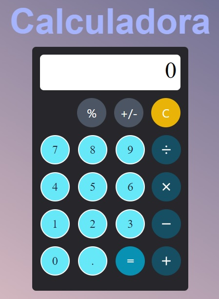

# Calculadora básica en React + Vite

Este proyecto es una calculadora básica en React + Vite que puede realizar operaciones de suma, resta, multiplicación, división y porcentaje, así como también cambiar el signo de un número.

## Instalación

Para utilizar esta calculadora, primero debes clonar este repositorio en tu computadora. Luego, debes ir a la carpeta del proyecto y ejecutar el siguiente comando para instalar las dependencias:

npm install

## Uso

Una vez que hayas instalado las dependencias, puedes ejecutar la aplicación en modo de desarrollo con el siguiente comando:

npm run dev

Este comando abrirá la aplicación en la dirección `http://127.0.0.1:5173`. Desde aquí, puedes utilizar la calculadora siguiendo las instrucciones en pantalla.

Cuando estés listo para construir la aplicación para producción, ejecuta el siguiente comando:

npm run build

Este comando creará una versión optimizada de la aplicación en la carpeta `dist`, que puedes luego subir a un servidor web para que sea accesible al público.

### Ejemplo

## Notas adicionales

- Esta calculadora solo maneja operaciones básicas (+, -, *, /, %) y cambio de signo (+/-).
- Si el segundo número ingresado es 0 en una operación de división, el programa mostrará un mensaje de error y te pedirá que ingreses otro número.

## Contribuir

Este proyecto es de código abierto. Si deseas contribuir, por favor sigue los siguientes pasos:

1. Realiza un fork del repositorio.
2. Crea una rama con tus cambios (`git checkout -b mi-nueva-rama`).
3. Realiza tus cambios y haz commit.
4. Haz push a la rama (`git push origin mi-nueva-rama`).
5. Crea un pull request.

## Autor

Este proyecto fue desarrollado por Tony Warrior.

